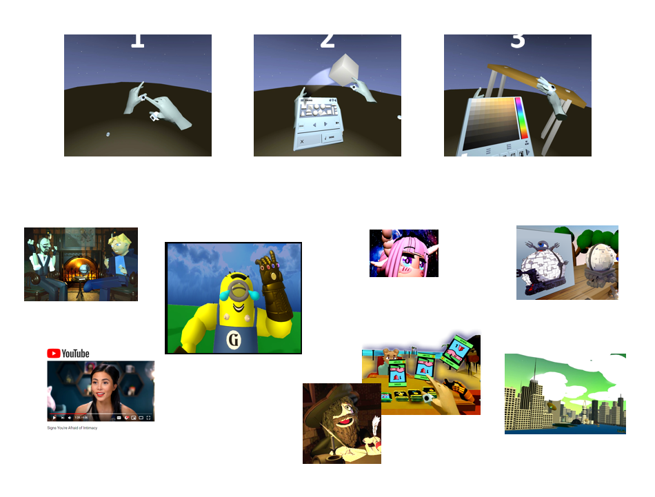

# Anyland
 Anyland is a social virtual reality sandbox universe where everything is created with your own hands, right in the world!
 
 Disclaimer: I would do pretty much everything differently with the project organization & source logic, but hopefully this set of extracted files (focused in particular on general-need code and importing/ exporting of the Anyland data structure) is of use to you!

For more, see <a href="http://anyland.com">Anyland.com</a>