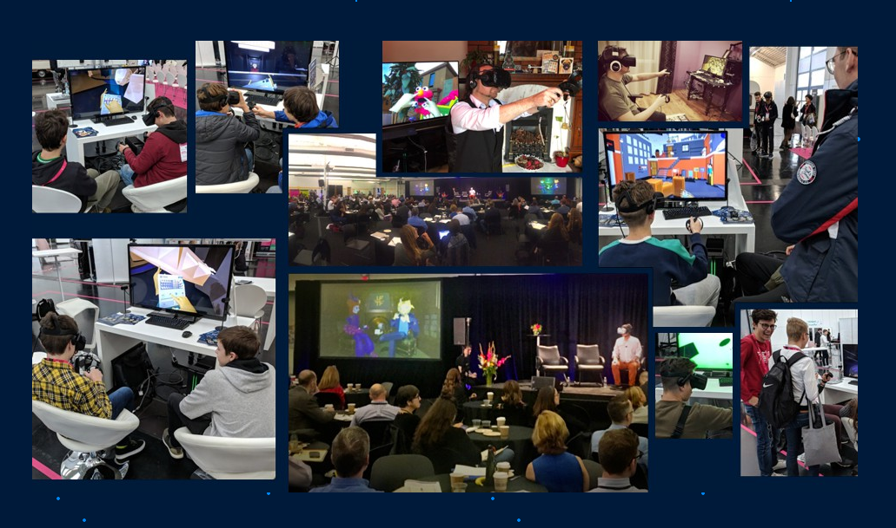

# Anyland
 Anyland is a social virtual reality sandbox universe where everything is created with your own hands, right in the world!
 
 This smaller file selection from a much bigger project is especially focused on general use and data import/ export -- please note I'd do many things different with organization & source logic if I were to write it now, but hopefully it's of use to you!

For more, including data and in-VR script language references, see <a href="http://anyland.com">Anyland.com</a>.

Anyland is co-created with Scott Lowe, and supported by all of you <a href="https://www.patreon.com/anyland">Patreons</a>!
